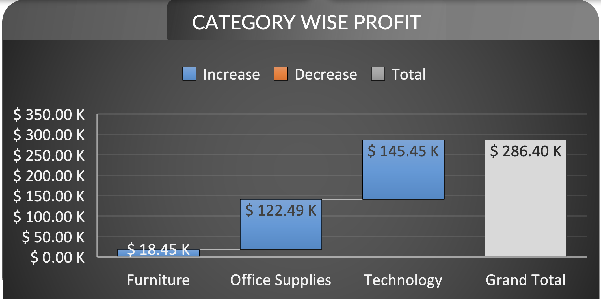
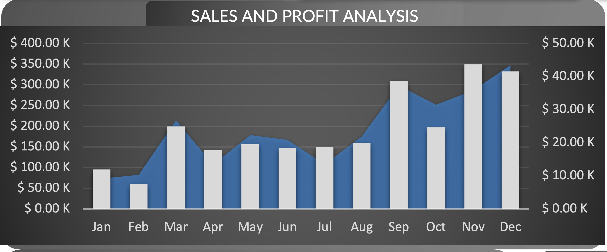
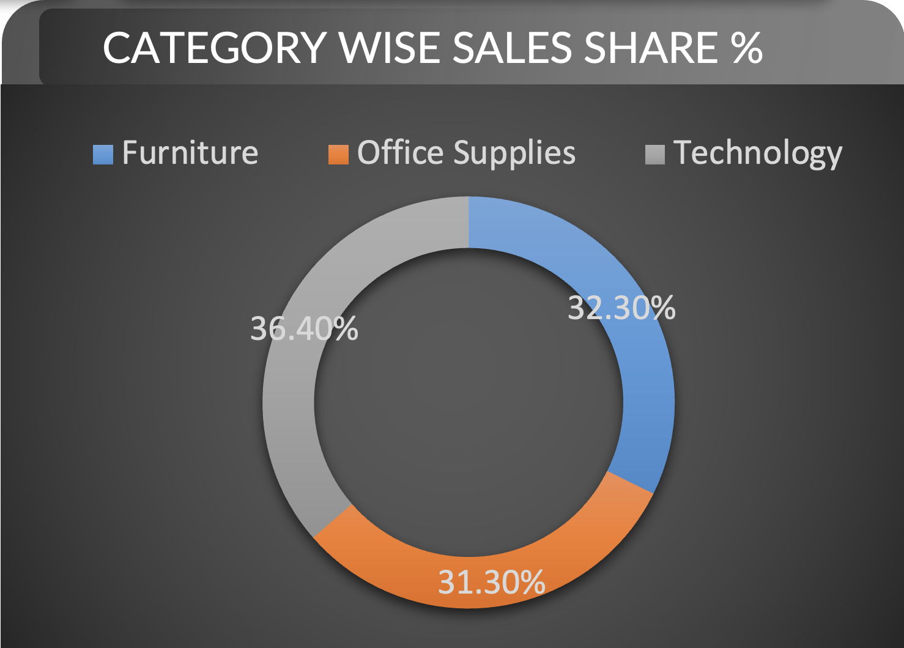
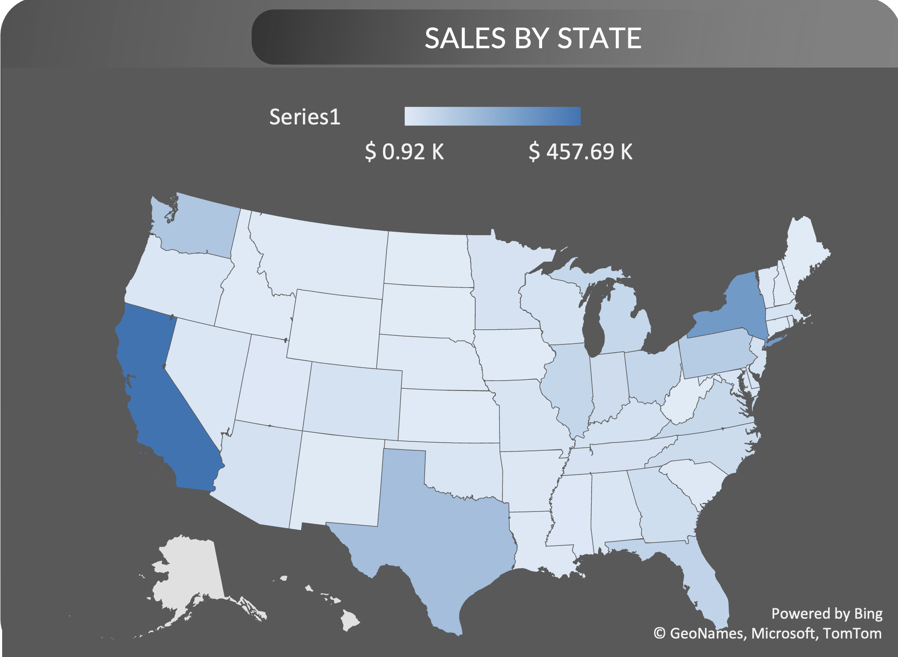
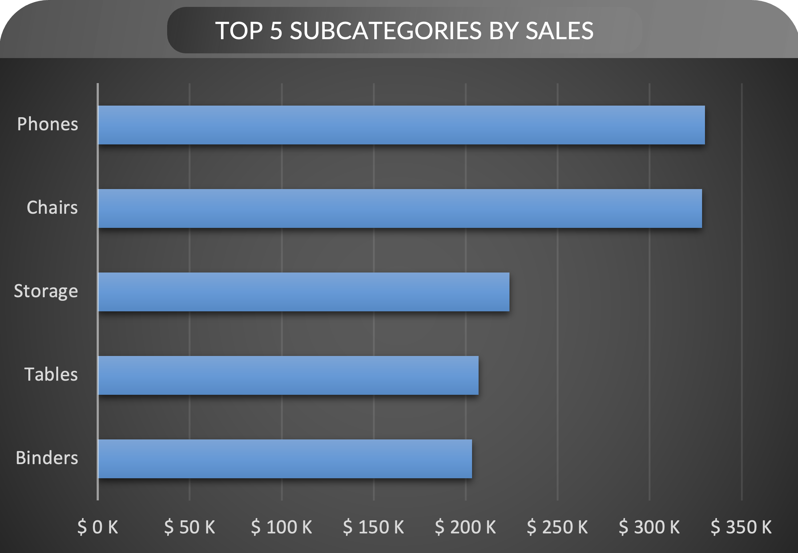
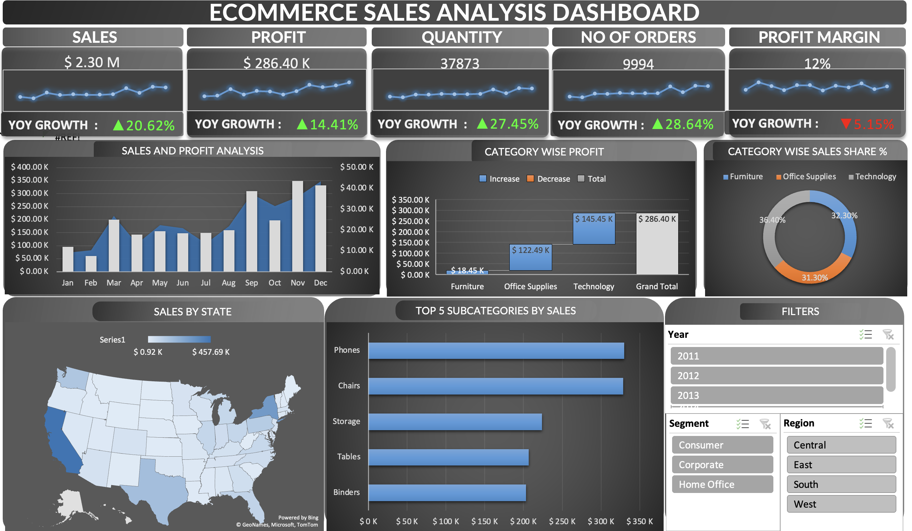

# 📊 Ecommerce Sales Analysis Dashboard

## 🔍 Overview
This project presents a comprehensive interactive dashboard that analyzes ecommerce sales performance across multiple dimensions. Built to provide insights into revenue trends, order volume, profit margins, and regional performance, the dashboard enables data-driven decision-making for stakeholders.

## 📈 Key Metrics Tracked
- **Sales**: $2.30M (YoY Growth: 🔼 20.62%)
- **Profit**: $286.40K (YoY Growth: 🔼 14.41%)
- **Quantity Sold**: 37,873 units (YoY Growth: 🔼 27.45%)
- **Number of Orders**: 9,994 (YoY Growth: 🔼 28.64%)
- **Profit Margin**: 12% (YoY Growth: 🔻 5.15%)

## 🧩 Dashboard Components
- **Sales & Profit Trend (Monthly)**: Visualizes monthly sales and profit figures to identify seasonal trends.
- **Category-Wise Profit**: Breaks down profit performance across key product categories (Furniture, Office Supplies, Technology).
- **Category-Wise Sales Share**: Donut chart showing the percentage contribution of each category to total sales.
- **Top 5 Subcategories by Sales**: Highlights leading product subcategories such as Phones, Chairs, and Storage.
- **Sales by State (Map)**: Geographic visualization of sales performance across U.S. states.
- **Interactive Filters**:
  - Year: 2011, 2012, 2013
  - Segment: Consumer, Corporate, Home Office
  - Region: Central, East, South, West

## 🛠️ Tools & Technologies
- **Excel** for data processing, dashboard creation, and visualizations
- **PivotTables** and **PivotCharts** for aggregation and dynamic exploration
- **Conditional formatting** and **interactive slicers** to enhance usability

## 📌 Key Performance Indicators (KPIs)

This section of the dashboard provides a high-level snapshot of ecommerce performance using five essential KPIs. Each metric includes current year values and Year-over-Year (YoY) growth indicators with trend lines.

| KPI             | Current Value | YoY Growth   | Trend Description                                   |
|----------------|---------------|--------------|-----------------------------------------------------|
| **Sales**       | $2.30M        | 🔼 **+20.62%** | Strong upward trend in overall sales revenue.       |
| **Profit**      | $286.40K      | 🔼 **+14.41%** | Consistent increase in profit, reflecting healthy margins. |
| **Quantity**    | 37,873 units  | 🔼 **+27.45%** | Notable rise in units sold, showing volume growth.  |
| **No. of Orders** | 9,994       | 🔼 **+28.64%** | Significant jump in total orders placed.            |
| **Profit Margin** | 12%         | 🔻 **-5.15%**  | Slight decline in margin, possibly due to discounts or cost increases. |

### 📈 Interpretation:
- All key metrics except **Profit Margin** showed positive YoY growth.
- **Profit Margin** dropped slightly despite higher sales and profit, indicating potential changes in pricing strategy, cost structure, or product mix.
- The upward trend lines in Sales, Profit, Quantity, and Orders confirm overall business growth and performance improvement.

## 📈 Monthly Sales and Profit Analysis

This chart provides a combined monthly overview of **Sales** (blue area) and **Profit** (gray bars) for the year. It helps identify seasonal trends, peak performance periods, and potential areas for improvement.

### 🧾 Key Observations:

- **March, September, and November** saw the **highest sales and profits**, indicating strong seasonal demand or successful promotions.
- **February** showed the **lowest sales and profit**, possibly due to shorter duration or lower customer activity.
- **Steady growth** is visible from **August to December**, with a notable surge starting in **September**, peaking in **November**.
- **June and July** maintained moderate performance, suggesting a mid-year plateau.
- The **alignment of high sales with high profit** in key months suggests healthy margin management.

### 📊 Use Case:
This chart supports business decisions like:
- Timing of **marketing campaigns**.
- Planning for **inventory and staffing** in peak months.
- Analyzing **low-performance months** for corrective action.

## 🗂️ Category Wise Profit Analysis

This chart presents the profit contribution by product category and the overall total profit. It helps identify which categories are the most profitable and where improvements could be made.

### 🔍 Breakdown:

- **Technology** contributed the **highest profit** with **$145.45K**, accounting for over half of the total.
- **Office Supplies** followed with **$122.49K** in profit.
- **Furniture** contributed **$18.45K**, the **lowest among all categories**, but still a positive margin.
- The **Grand Total profit** across all categories amounted to **$286.40K**.

### 🧠 Insights:

- Investing more in **Technology** and **Office Supplies** could yield higher returns.
- There may be opportunities to optimize **Furniture** sales or reduce costs to increase its profit margin.
- No category reported a loss, indicating overall healthy profitability.

# Sales by State Analysis

## Breakdown

- **Data Representation**: The map illustrates sales distribution across various states in the United States, using varying shades of blue to indicate the sales volume.
- **Scale**: 
  - Light blue indicates lower sales figures, starting from **$0.92K**.
  - Dark blue represents higher sales figures, reaching up to **$457.69K**.

## Insights

- **Highest Sales**: 
  - The state showing significant sales is indicated by the darkest shade of blue, representing sales around **$457.69K**.
  - **Lowest Sales**: 
  - Areas represented in the lightest blue indicate minimal sales, with values around **$0.92K**.
- **Regional Patterns**: 
  - There appears to be a concentration of higher sales in specific states, particularly in the Southwest and parts of the East Coast.
  - The distribution illustrates regional market strengths, which can guide business strategies and target advertising.
- **Opportunities for Growth**: 
  - States with lighter shades may present opportunities for increased market penetration or improved marketing efforts to boost sales figures.

# Top 5 Subcategories by Sales

## Breakdown
- **Categories Analyzed**:
  - Phones
  - Chairs
  - Storage
  - Tables
  - Binders

- **Sales Performance**:
  - **Phones**: Highest sales, leading the chart significantly.
  - **Chairs**: Second in sales, following closely behind phones.
  - **Storage**: Positioned in the middle of the sales ranking.
  - **Tables**: Moderate sales, lower than storage.
  - **Binders**: Lowest sales among the top five categories.

## Insights
- **Leading Category**: Phones dominate the sales figures, indicating high demand.
- **Market Preferences**: The presence of furniture items (Chairs, Tables, Storage) suggests a consistent need for home and office products.
- **Sales Distribution**: The gap between phones and the other categories indicates a potential niche market that could be explored further.
- **Opportunity for Growth**: Categories like Binders may benefit from targeted marketing strategies to boost their sales performance.

# Final Dashboard

## 🎯 Insights Delivered
- Steady growth in sales and order volume year-over-year
- Technology is the most profitable category, while Furniture saw losses
- West Coast states, particularly California, are top-performing in sales
- Phones and Chairs are the best-selling subcategories

## 📌 Project Goals
- Enable quick identification of business trends and anomalies
- Support strategic planning through intuitive visual storytelling
- Create an executive-level summary for performance monitoring

**Conclusion and Future Prospects for the E-commerce Sales Analysis Project**

**Conclusion:**
- **Sales Performance:**
  - The project has yielded a total sales revenue of **$2.30 million**, reflecting a year-over-year (YoY) growth of **20.62%**. This upward trend indicates strong market demand and the effectiveness of sales strategies implemented.
- **Profit Analysis:**
  - Overall profit stands at **$286.40K**, representing a YoY increase of **14.41%**. This indicates improved efficiency in cost management and profitability, although this growth rate is slightly lower than sales growth.
- **Order Metrics:**
  - The total number of orders is recorded at **9,994**, with a YoY growth of **28.64%**. This suggests an increase in customer acquisition and repeat purchases.
- **Profit Margins:**
  - The profit margin is reported at **12%**, with a decrease of **5.15%** YoY. This decline may signal rising costs or discounts impacting margins, necessitating a strategic review.
- **Category Insights:**
  - The dashboard reveals that **Office Supplies** led profit contributions, with significant year-over-year growth, followed closely by **Technology** and **Furniture**. 
  - Notably, **Phones** emerged as the top-selling subcategory, indicating consumer preferences that could be leveraged for future promotions.
- **Sales by Region:**
  - The analysis indicates robust performance in certain states, particularly in regions like California and New York. Tailored marketing strategies in these areas could capitalize on existing customer bases.

**Future Prospects:**
- **Market Expansion:**
  - There is potential for exploring new markets and customer segments, including further engaging **Home Office** customers, which has seen increasing trends post-pandemic.
- **Product Diversification:**
  - Investment in product diversification, especially within high-performing categories like **Office Supplies** and **Technology**, may attract a broader customer base and enhance sales figures.
- **Cost Management Strategies:**
  - Implementing strategies to reclaim declining profit margins, such as supplier negotiations or an analysis of discount structures, could stabilize and eventually improve profitability.
- **Enhanced Customer Engagement:**
  - Further investment in customer relationship management (CRM) systems to analyze purchasing behaviors and enhance targeted marketing efforts could drive sales and improve customer satisfaction.
- **Technological Integration:**
  - Leveraging advanced analytics and AI technologies may provide deeper insights into consumer trends, enabling more agile decision-making.
- **Sustainability Initiatives:**
  - Adopting sustainable practices and products could attract environmentally-conscious consumers, differentiating the brand in a competitive marketplace.
